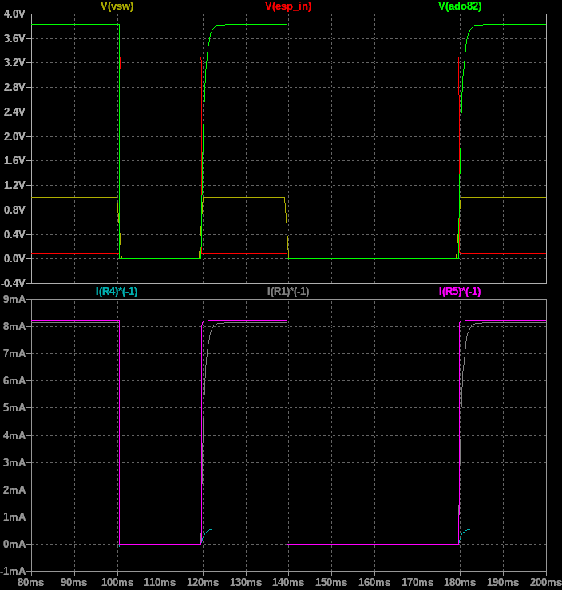

# Simulations

This folder contains simulation of various circuits needed to interface with the teletype.

The simulations were done in [LTSpice](https://www.analog.com/en/design-center/design-tools-and-calculators/ltspice-simulator.html).

## Power supply

For powering the receiving magnet of the teletype a current of about 40 mA is required. The magnet has an inductance of about **2.6 Henry**.
We chose to build a power supply from a 230 V to ~26 V Transformer we found lying around. Using a voltage doubler circuit we obtained a voltage of about 50 V when the circuit is not loaded (see graphs below).
For the simulation a switch simulates the action that is later performed by an opto-coupler.
As the magnet is required to engaged and disengaged quickly we need a time constant (Tau) that is noticeably shorter than the time of one bit at the used baud rate.  
`Baudrate = 50 Bd -> t_bit = 20 ms -> Tau << 20 ms`  
To obtain a suitable tau while also driving enough current we chose a 1 kOhm Resistor that can handle 5W.  
Finally a freewheeling diode (most any kind is suitable) protects our switching element.

  

Voltage doubler circuit

  

Simulated values for supply voltage (ripple) and current drawn by the receiving magnet.

## Receiver

For receiving bits from the teletype keyboard we need to detect the state of the transmitting switch. If it was just the switch we could have used the opto-coupler directly.  

Since the transmit circuit of the teletype also contains several solenoids in the paper tape reader, which we also wanted to use, the required current would be too much for the opto-coupler to handle.  

  

Receiver isolation circuit

